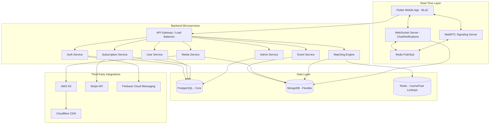

# SYSTEM DESIGN + IMPLEMENTATION BLUEPRINT: UNDISCOVERED HOOPS

## 1. PRIMARY OBJECTIVE
Produce a complete engineering blueprint that enables teams to immediately start implementation of the Undiscovered Hoops platform, including the Flutter frontend, modular backend, real-time messaging/WebRTC system, Stripe subscriptions, DevOps pipelines, and QA strategies.

---

## 2.1 SYSTEM ARCHITECTURE DIAGRAM (TEXT FORM)



---

## 2.2 FRONTEND ARCHITECTURE (FLUTTER BLoC)

### Folder Structure (Final Production)
```text
frontend_flutter/lib/
├── core/
│   ├── config/ (Env vars, app config)
│   ├── network/ (Dio client, interceptors)
│   ├── errors/ (Failure classes, exception handling)
│   └── utils/ (Formatters, validators)
├── shared/
│   ├── widgets/ (Buttons, inputs, generic UI)
│   ├── themes/ (Colors, typography, theme data)
│   └── components/ (Complex shared UI like video_player_wrapper)
├── features/
│   ├── auth/
│   │   ├── bloc/ (auth_bloc.dart, auth_event.dart, auth_state.dart)
│   │   ├── models/ (user_model.dart, login_dto.dart)
│   │   ├── repositories/ (auth_repository.dart)
│   │   ├── data_sources/ (auth_remote_data_source.dart)
│   │   └── views/ (login_page.dart, register_page.dart)
│   ├── profile/
│   ├── reels/
│   ├── chat/
│   ├── calls/
│   ├── events/
│   ├── news/
│   ├── matching/
│   ├── subscription/
│   └── admin/
```

### Global Rules:
- **No UI Logic in Widgets:** Widgets dispatch events and listen to state.
- **No API Calls Outside Repositories:** All `Dio` calls exist in `data_sources`. Repositories map DTOs to Domain Models.
- **Immutable States:** All states must extend `Equatable` and use `copyWith`.
- **Standardized Errors:** Error states must yield a `Failure` object (e.g., `ServerFailure`, `NetworkFailure`).

---

## 2.3 BACKEND ARCHITECTURE

### Services & Responsibilities

1. **Auth Service**
   - *Responsibilities:* JWT issuance, social logins, RBAC assignment.
   - *DB:* PostgreSQL (`users`, `roles`).
   - *Failure Cases:* Invalid token, expired JWT, brute-force limits.

2. **User Service**
   - *Responsibilities:* Profile CRUD, claim profile logic, role permissions.
   - *DB:* PostgreSQL (`profiles`, `user_roles`).
   - *Failure Cases:* Profile not found, unauthorized edits.

3. **Media Service**
   - *Responsibilities:* Video/Image uploads, CDN presigned URLs, transcoding triggers.
   - *DB:* MongoDB (`media_metadata`).
   - *Failure Cases:* Upload timeout, invalid MIME type, large file rejection.

4. **Chat Service (WebSocket)**
   - *Responsibilities:* Real-time text/media messaging, read receipts, offline sync.
   - *DB:* MongoDB (`messages`, `conversations`). Redis (online presence).
   - *Failure Cases:* Connection drop, message delivery failure (retry logic).

5. **Call Signaling Service (WebRTC)**
   - *Responsibilities:* WebRTC SDP offers/answers, ICE candidate exchange.
   - *DB:* Redis (ephemeral session state).
   - *Failure Cases:* Signaling server disconnect, ICE failure.

6. **Matching Engine Service**
   - *Responsibilities:* Swipe logic, AI compatibility scoring, feed generation.
   - *DB:* MongoDB (`swipes`, `matches`). Redis (cached feeds).
   - *Failure Cases:* Feed exhaustion, scoring latency.

7. **Subscription Service**
   - *Responsibilities:* Stripe integration, tier validation, trial management.
   - *DB:* PostgreSQL (`subscriptions`, `payments`).
   - *Failure Cases:* Card decline, webhook failure.

8. **Event Service**
   - *Responsibilities:* Event creation, RSVPs, attendance tracking.
   - *DB:* MongoDB (`events`, `rsvps`).
   - *Failure Cases:* Overbooking, overlapping schedules.

9. **Notification Service**
   - *Responsibilities:* APNS/FCM push dispatch, in-app notifications.
   - *DB:* MongoDB (`notifications`).
   - *Failure Cases:* FCM token expiration, rate limiting by Apple/Google.

10. **Admin Service**
    - *Responsibilities:* Moderation, analytics aggregation, CMS.
    - *DB:* Connects across DBs via read-replicas.
    - *Failure Cases:* Unauthorized access.

---

## 2.4 DATABASE DESIGN

### PostgreSQL (Relational Data)
- **Users Table:** `id` (PK, UUID), `email`, `password_hash`, `role`, `created_at`. *Indexes:* `email`.
- **Profiles Table:** `id` (PK), `user_id` (FK), `first_name`, `last_name`, `height`, `position`, `school`, `is_claimed`. *Indexes:* `user_id`, `position`.
- **Subscriptions Table:** `id` (PK), `user_id` (FK), `stripe_customer_id`, `tier`, `status`, `expires_at`. *Indexes:* `user_id`, `status`.

### MongoDB (Document/Flexible Data)
- **Reels Collection:** `_id` (PK), `user_id`, `video_url`, `thumbnail_url`, `tags`, `likes_count`, `created_at`. *Indexes:* `user_id`, `tags`.
- **Messages Collection:** `_id` (PK), `conversation_id`, `sender_id`, `content`, `media_url`, `is_read`, `timestamp`. *Indexes:* `conversation_id`, `timestamp`.
- **Matches Collection:** `_id` (PK), `user_1_id`, `user_2_id`, `match_score`, `timestamp`. *Indexes:* `user_1_id`, `user_2_id`.
- **Events Collection:** `_id` (PK), `creator_id`, `title`, `date`, `location`, `attendees`. *Indexes:* `date`, `location`.
- **Notifications Collection:** `_id` (PK), `user_id`, `type`, `payload`, `is_read`, `created_at`. *Indexes:* `user_id`, `is_read`.

---

## 2.5 REAL-TIME SYSTEM DESIGN

### WebSocket Architecture
- **Tech:** Socket.io or native WebSockets via NestJS Gateways.
- **Scaling:** Redis Pub/Sub backplane to broadcast events across horizontal nodes.
- **Chat Flow:**
  1. Client connects with JWT.
  2. Server updates Redis presence to `online`.
  3. Client emits `send_message`.
  4. Server validates, saves to MongoDB, publishes to Redis room.
  5. Recipient node receives event, pushes to recipient via WS.
  6. If recipient offline, Notification Service triggers FCM push.

### Call Signaling (WebRTC)
- **Flow:**
  1. Caller emits `call_initiate` with target User ID.
  2. Server checks recipient presence. If online, routes `call_incoming`.
  3. Recipient accepts, caller generates SDP Offer, sends via WS.
  4. Recipient generates SDP Answer, sends via WS.
  5. Both parties exchange ICE candidates via WS.
  6. Direct P2P connection established (or via TURN relay).
- **Reconnect:** 10-second ICE restart window before call termination.

---

## 2.6 API CONTRACTS (CRITICAL)

### Auth & Users
`POST /auth/login`
- **Req:** `{ "email": "str", "password": "str" }`
- **Res:** `{ "accessToken": "str", "refreshToken": "str", "user": Object }`
- **Errors:** `401 Unauthorized`, `400 Bad Request`

`GET /users/:id/profile`
- **Req:** `Headers: Authorization Bearer <token>`
- **Res:** `{ "id": "uuid", "firstName": "str", "position": "str", ... }`

### Reels
`POST /reels/upload/presigned`
- **Req:** `{ "filename": "str", "contentType": "video/mp4" }`
- **Res:** `{ "uploadUrl": "str", "videoId": "str" }`

### Chat
`POST /chat/messages` (Fallback to REST for history)
- **Req:** `Headers: Authorization Bearer <token>`, `Query: conversationId, cursor`
- **Res:** `{ "messages": [...], "nextCursor": "str" }`

### Matching
`POST /matching/swipe`
- **Req:** `{ "targetUserId": "str", "action": "LIKE | DISLIKE | BOOST" }`
- **Res:** `{ "isMatch": bool, "matchId": "str" }`

### Subscriptions
`POST /subscription/checkout`
- **Req:** `{ "tierId": "str" }`
- **Res:** `{ "stripeCheckoutUrl": "str" }`

---

## 2.7 DEVOPS PIPELINE DESIGN

### CI/CD Flow
- **Branching:** `main` (Prod), `staging` (QA), `feature/*` (Dev).
- **CI Pipeline (GitHub Actions):** 
  - Trigger on PR to `main`/`staging`.
  - Flutter: `flutter analyze`, `flutter test`.
  - Backend: `npm run lint`, `npm run test`, `docker build`.
- **CD Pipeline:**
  - Trigger on merge to `main`.
  - Backend: Push Docker images to ECR, update ECS/EKS deployments.
  - Frontend: Build `.apk`/`.ipa`, push to Firebase App Distribution (QA) / TestFlight.

### Infrastructure (AWS)
- **Compute:** EKS (Elastic Kubernetes Service) for microservices.
- **Routing:** ALB (Application Load Balancer) + API Gateway.
- **Data:** RDS (PostgreSQL), DocumentDB (MongoDB), ElastiCache (Redis).
- **Media:** S3 + Cloudflare CDN.
- **Observability:** Datadog or AWS CloudWatch (Logs, Metrics), Sentry (Crash Reporting).

---

## 2.8 QA STRATEGY (FULL AUTOMATION)

### Test Layers
- **Unit Tests:** Business logic inside BLoCs and NestJS Services (Requirement: >80% coverage).
- **Widget Tests:** Flutter UI component rendering and interaction.
- **API Tests:** Postman/Newman or Jest e2e tests validating API contracts.
- **Integration Tests:** Database transactions and WebRTC signaling flows.
- **Load Tests:** K6 scripts simulating 10k concurrent WebSocket connections and reel video requests.

### Critical Gated Scenarios
Release is blocked if ANY fail:
1. User Registration + Login.
2. Video Upload Pipeline (CDN to DB).
3. End-to-end Chat Delivery (Sender -> WS -> DB -> Recipient).
4. WebRTC Connection Establishment.
5. Stripe Payment Webhook Processing.

---

## 2.9 AI MATCHING ENGINE DESIGN

### Input Features
- **Static:** Position, Height, Class Year, School Tier.
- **Dynamic:** Profile completeness, video views, likes received, swipe velocity.
### Scoring Algorithm Logic
- Base compatibility score (0-100) calculated using a weighted matrix (e.g., Coach seeking PG -> High weight on PG players).
- Engagement multiplier: Active users get a 1.2x visibility boost.
### Feed Personalization & Cold Start
- **Cold Start:** New users are shown globally popular, highly-rated profiles mixed with newly joined users to test their swipe preferences.
- **Ranking:** Redis sorts available profiles via Sorted Sets (`ZSET`), updating asynchronously based on background AI cron jobs.

---

## 2.10 RISK ANALYSIS

1. **WebRTC Call Stability**
   - *Risk:* Strict NATs preventing P2P connections.
   - *Mitigation:* Deploy globally distributed TURN servers (e.g., Coturn or Twilio Network Traversal).
2. **Video Upload Pipeline Reliability**
   - *Risk:* Mobile network drops during 100MB+ video uploads.
   - *Mitigation:* Chunked uploads direct-to-S3 with automatic background retries in Flutter.
3. **Data Consistency (Microservices)**
   - *Risk:* User deleted in Postgres, but profile remains in Mongo.
   - *Mitigation:* Event-driven architecture (Kafka/RabbitMQ) for inter-service deletion broadcasts.
4. **WebSocket Scaling**
   - *Risk:* Single node hitting max file descriptors.
   - *Mitigation:* Redis Pub/Sub adapter, Horizontal Pod Autoscaling (HPA) in Kubernetes.

---

## 2.11 IMPLEMENTATION ROADMAP (SPRINT PLAN)

- **Sprint 1 (Weeks 1-2):** Core Infrastructure, CI/CD, Auth Service (JWT), Flutter Base BLoC setup & Login Flow.
- **Sprint 2 (Weeks 3-4):** Profiles Service, Media Upload Pipeline (S3/CDN), Flutter Reels Feed UI & Upload implementation.
- **Sprint 3 (Weeks 5-6):** Chat Service (WebSockets), Redis setup, Offline sync logic, Flutter Chat UI.
- **Sprint 4 (Weeks 7-8):** Call Signaling Service (WebRTC), TURN server setup, Flutter Audio/Video call UI.
- **Sprint 5 (Weeks 9-10):** AI Matching Engine, Swipe UI, Feed Personalization algorithms.
- **Sprint 6 (Weeks 11-12):** Subscription Service (Stripe integration), Notification Service (FCM/APNS), Payment flow UI.
- **Sprint 7 (Weeks 13-14):** Admin Dashboard, Comprehensive QA automation scripts, Performance Load Testing, App Store / Play Store Release Preparation.
